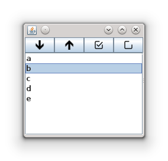
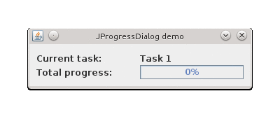
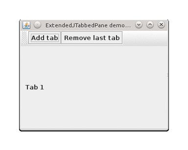
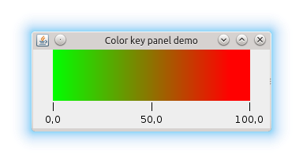
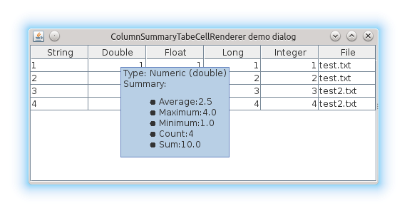

GC4S examples
=============

In this section you can find different examples of GC4S components. Code for all examples is provided at the `es.uvigo.ei.sing.hlfernandez.demo` package.

JHeatMap
------------
A component that shows a heatmap from a given double matrix. It allows zooming and changing gradient's colors.

JListPanel
------------
A component that wraps a JList to add common actions.

This component can also show a text field that allows filtering the elements shown.

JFileChooserPanel
------------
A component with a button to select a file (using a JFileChooser) and a text field that show the selected file.

JLimitedTextField
------------
An extension of JTextField to limit the length of the text.

AbstractInputJDialog
------------
An extension of JDialog to ease the creation of new input dialogs by providing common functionalities such as buttons pane, description or key bindings.

ExtendedJXTable
------------
An extension of JXTable that allows to hide/show the column visibility actions and also facilitates adding own actions to the ColumnControlButton.

CloseableJTabbedPane
------------
An extension of JTabbedPane that adds a close button to tabs.

JProgressDialog
------------
An extension of JDialog to ease the creation of simple progress dialogs based on a task list.

ExtendedJComboBox
------------
An extension of JComboBox that adjust its width to the maximum item width when the drop down list is being displayed.

ExtendedJTabbedPaneDemo
------------
An extension of JTabbedPane that allows setting wether the tab bar must be hidden if there is only one tab.

JParallelListsPanel
------------
A component that that wraps two JListPanel and allows moving elements between them.

ColorKeyLegend
------------
A component for displaying color key legends.

ColorLegend
------------
A component for displaying color legends.

ColumnSummaryTabeCellRenderer
------------
A table cell renderer that displays a column summary.

