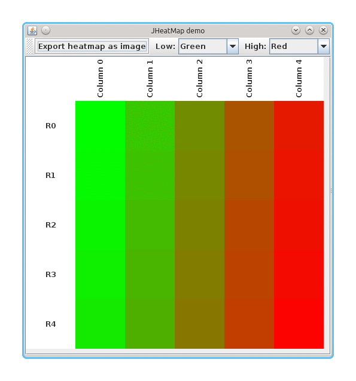

GC4S [](https://travis-ci.org/hlfernandez/GC4S) []()
========================

GC4S is an open-source library that provides a bioinformatics-oriented collection of GUI Components for (Java) Swing.

Projects using GC4S
-------------------
- [S2P](http://sing-group.org/s2p/): an open-source application for processing of 2D-gel and MALDI-based mass spectrometry protein data.
- [DEWE](http://sing-group.org/dewe/): an open-source application for executing differential expression analysis in RNA-Seq data.
- [SEDA](http://sing-group.org/seda/): an open-source application for processing FASTA files containing DNA and protein sequences.

GC4S modules
------------

This repository contains four GC4S modules:
- `gc4s`: the main module containing the components library.
- `gc4s-demo`: a module that contains examples of usage of the components in the `gc4s` module.
- `gc4s-genomebrowser`: a module that depends on the `gc4s` module to provide an interactive genome browser.
- `gc4s-genomebrowser-demo`: a module that contains an example of usage of the genome browser component.
- `gc4s-multiple-sequence-alignment-viewer`: a module that depends on the `gc4s` module to provide a multiple sequence alignments viewer.
- `gc4s-multiple-sequence-alignment-viewer-demo`: a module that contains an example of usage of the multiple sequence alignments viewer.
- `gc4s-statistics-tests-table`: a module that depends on the `gc4s` module to provide a statistical tests table.
- `gc4s-statistics-tests-table-demo`: a module that contains examples of usage of the statistical tests table components.

Using GC4S
----------
Add the following repository and dependency declarations to your `pom.xml` in order to use the `gc4s` module:
```xml
	<repositories>
		<repository>
			<id>sing-repository</id>
			<name>SING repository</name>
			<url>http://maven.sing-group.org/repository/maven/</url>
		</repository>
	</repositories>
	
	<dependencies>
    	<dependency>
			<groupId>org.sing_group</groupId>
			<artifactId>gc4s</artifactId>
			<version>1.2.0</version>
		</dependency>
	</dependencies>
```

Examples
--------

The following image shows `JHeatMap`, a component that shows a heatmap from a given double matrix. It allows zooming, changing gradient's colors and exporting the heatmap as image.



The following image shows `JFileChooserPanel`, a component with a button to select a file (using a `JFileChooser`) and a text field that show the selected file. You have full control of how the underlying `JFileChooser` since you have can set file filters or choose the dialog mode.


These are just two examples of GC4S components. To see more, please, see the [examples](gc4s/EXAMPLES.md) section.
