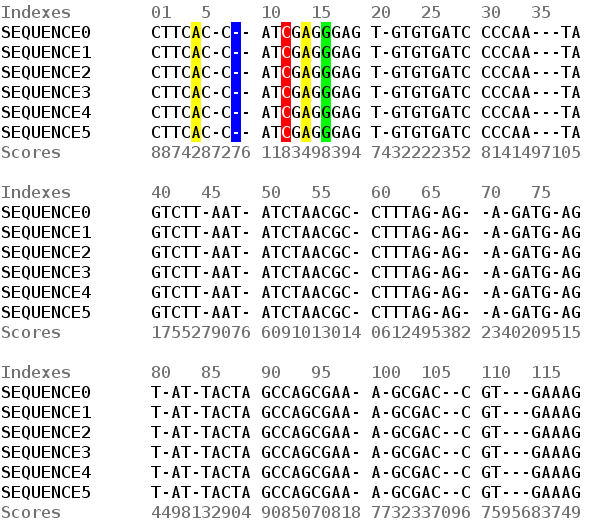
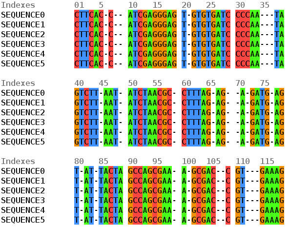

The `gc4s-multiple-sequence-alignment-viewer` module
=================================

This module provides the `MultipleSequenceAlignmentViewerPanel` component to display multiple sequence alignments. By using this module, it is also possible to use the main `gc4s` components. This module also provides the `MultipleSequenceAlignmentViewerControl` that adds some functionalities to the panel.

The `gc4s-multiple-sequence-alignment-viewer-demo` provides different examples of usage of these components with sample data. Javadoc documentation is available [here](http://sing-group.org/gc4s/javadoc/).



This module also provides the [bioSyntax](https://biosyntax.org/) nucleotide colouring scheme for the complete IUPAC ambiguous base set.



Using this module
-----------------------
Add the following repository and dependency declarations to your `pom.xml`:
```xml
	<repositories>
		<repository>
			<id>sing-repository</id>
			<name>SING repository</name>
			<url>http://maven.sing-group.org/repository/maven/</url>
		</repository>
	</repositories>
	
	<dependencies>
		<dependency>
			<groupId>org.sing_group</groupId>
			<artifactId>gc4s-multiple-sequence-alignment-viewer</artifactId>
			<version>1.5.0</version>
		</dependency>
	</dependencies>
```

A simple example
----------------------
The following code (available at `org.sing_group.gc4s.msaviewer.demo.MultipleSequenceAlignmentViewerPanelDemo` of the demo module) shows the minimum code required to create a `MultipleSequenceAlignmentViewerPanel`. The demo module provides more advanced examples that show the usage of renderers and models.

```java
import static org.sing_group.gc4s.visualization.VisualizationUtils.showComponent;

import java.util.Arrays;
import java.util.List;

import javax.swing.JFrame;

import org.sing_group.gc4s.msaviewer.MultipleSequenceAlignmentViewerConfiguration;
import org.sing_group.gc4s.msaviewer.MultipleSequenceAlignmentViewerPanel;
import org.sing_group.gc4s.msaviewer.Sequence;

public class MinimalMultipleSequenceAlignmentViewerPanelDemo {
	public static void main(String[] args) {
		List<Sequence> sequences = Arrays.asList(new Sequence() {

			@Override
			public String getSequence() {
				return "ACTGACTGACTGACTGACTGACTGACTGACT-";
			}

			@Override
			public String getHeader() {
				return "Sequence 1";
			}
		}, new Sequence() {

			@Override
			public String getSequence() {
				return "AC-GAC-GACTGACT-ACTGACTGACTGACTG";
			}

			@Override
			public String getHeader() {
				return "Sequence 2";
			}
		});

		MultipleSequenceAlignmentViewerConfiguration configuration = 
			new MultipleSequenceAlignmentViewerConfiguration(
				10, 	// The length of the sequence label
				5,		// The number of tabs after the sequence label
				10, 	// The length of each block
				4, 		// The number of blocks per line
				16, 	// The font size
				true, 	// Whether position indexes must be shown or not
				true, 	// Whether upper tracks must be shown or not
				true 	// Whether bottom tracks must be shown or not
		);

		MultipleSequenceAlignmentViewerPanel viewerPanel = 
			new MultipleSequenceAlignmentViewerPanel(sequences, configuration);

		showComponent(viewerPanel, JFrame.MAXIMIZED_BOTH);
	}
}
```
