Gallery of GC4S components
==========================

In this section you can find different examples of GC4S components. Code for all examples is provided at the `gc4s-demo` module.

Gallery contents:

  * [AbstractInputJDialog](#abstractinputjdialog)
  * [CardsPanel](#cardspanel)
  * [CloseableJTabbedPane](#closeablejtabbedpane)
  * [ColorKeyLegend](#colorkeylegend)
  * [ColorLegend](#colorlegend)
  * [ColorsListPanel](#colorslistpanel)
  * [ColumnSummaryTabeCellRenderer](#columnsummarytabecellrenderer)
  * [ComponentsListPanel](#componentslistpanel)
  * [CsvPanel](#csvpanel)
  * [DoubleRangeInputPanel](#doublerangeinputpanel)
  * [DoubleRangeSpinnerInputPanel](#doublerangespinnerinputpanel)
  * [ExtendedJComboBox](#extendedjcombobox)
  * [ExtendedJTabbedPane](#extendedjtabbedpane)
  * [ExtendedJXTable](#extendedjxtable)
  * [FilterableJXTable](#filterablejxtable)
  * [FontConfigurationPanel](#fontconfigurationpanel)
  * [Icons](#icons)
  * [IntegerRangeInputPanel](#integerrangeinputpanel)
  * [ItemSelectionPanel](#itemselectionpanel)
  * [JFileChooserPanel](#jfilechooserpanel)
  * [JListPanel](#jlistpanel)
  * [JInputList](#jinputlist)
  * [JLimitedTextField](#jlimitedtextfield)
  * [JMultipleFileChooserPanel](#jmultiplefilechooserpanel)
  * [JParallelListsPanel](#jparallellistspanel)
  * [JProgressDialog](#jprogressdialog)
  * [RadioButtonsPanel](#radiobuttonspanel)
  * [RangeInputPanel](#rangeinputpanel)
  * [RowHeaderExtendedJXTable](#rowheaderextendedjxtable)
  * [Wizard](#wizard)
  * [WorkingDialog](#workingdialog)

AbstractInputJDialog
--------------------
An extension of `JDialog` to ease the creation of new input dialogs by providing common functionalities such as buttons pane, description or key bindings.

CardsPanel
----------
A component that displays different components using a `CardLayout` and creates a combo box to control which one should be visible.

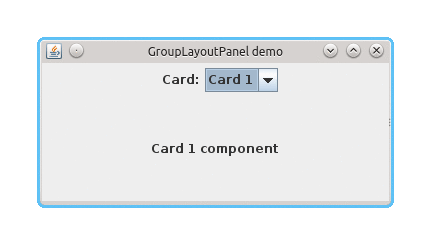

CloseableJTabbedPane
--------------------
An extension of `JTabbedPane` that adds a close button to tabs.

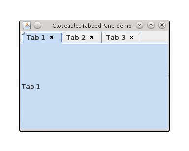

ColorKeyLegend
--------------
A component for displaying color key legends.

ColorLegend
-----------
A component for displaying color legends.

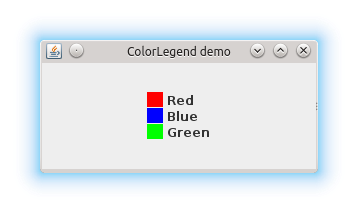

ColorsListPanel
---------------
A panel that allows the selection of several colors.

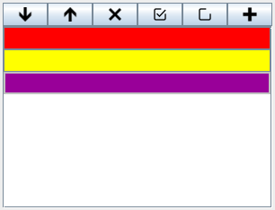

ColumnSummaryTabeCellRenderer
-----------------------------
A table cell renderer that displays a column summary.

ComponentsListPanel
-------------------
A component that allows showing a list of generic components with control buttons to add and remove them.

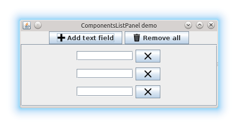

CsvPanel
--------
A panel that allows user to configure a CSV format.

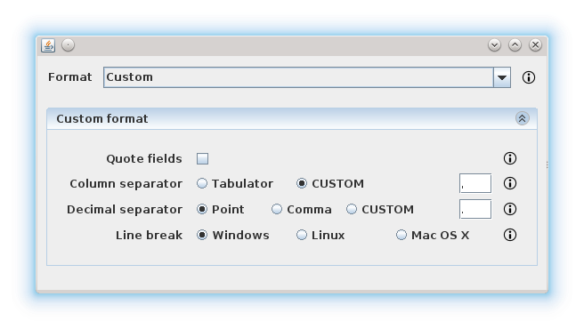

DoubleRangeInputPanel
---------------------
A panel that allows user to type a range of double values, checking that the minimum value is equal or lower than the maximum value.

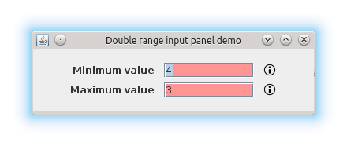

DoubleRangeSpinnerInputPanel
----------------------------
A panel that allows user to type a range of double values by using spinners.

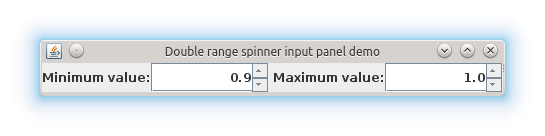

ExtendedJComboBox
-----------------
An extension of `JComboBox` that adjust its width to the maximum item width when the drop down list is being displayed.

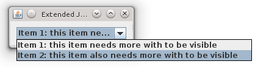

ExtendedJTabbedPane
-------------------
An extension of `JTabbedPane` that allows setting wether the tab bar must be hidden if there is only one tab.

ExtendedJXTable
---------------
An extension of `JXTable` that allows to hide/show the column visibility actions and also facilitates adding own actions to the `ColumnControlButton`.

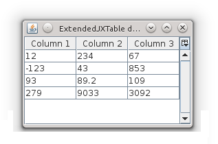

FilterableJXTable
-----------------
An extension of `JXTable` that allows to establish a row filter in an easy way.

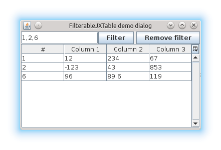

FontConfigurationPanel
----------------------
A panel that allows configuring a `Font`.

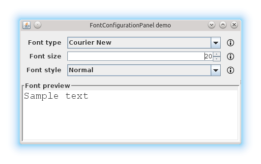

Icons
-----
A class that provides a great variety of icons as static constants.

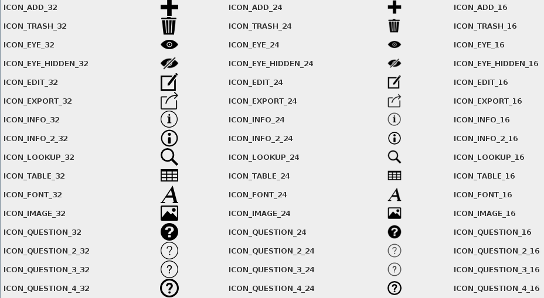

IntegerRangeInputPanel
----------------------
A panel that allows user typing a range defined by values, taking into account that the minimum value should always be lower or equal to the maximum value.

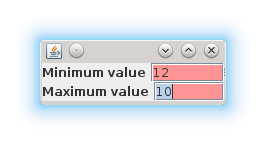

ItemSelectionPanel
------------------
A panel that allows users choosing a specified number of items from  different combo boxes.

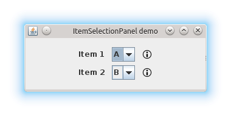

JFileChooserPanel
-----------------
A component with a button to select a file (using a `JFileChooser`) and a text field that show the selected file.

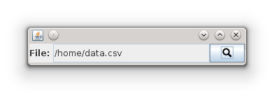

JListPanel
----------
A component that wraps a `JList` to add common actions.

This component can also show a text field that allows filtering the elements shown.

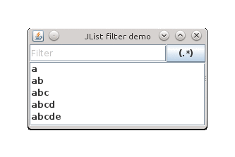

JInputList
----------
A class that encloses a `JListPanel<String>` to provide the ability of adding new elements to the list.
 
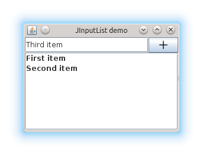

JLimitedTextField
-----------------
An extension of `JTextField` to limit the length of the text.

JMultipleFileChooserPanel
-------------------------
A component with a button to select multiple files (using a `JFileChooser`) and a list that shows the selected files.

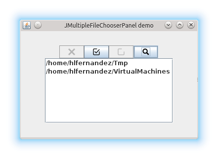

JParallelListsPanel
-------------------
A component that that wraps two `JListPanel` and allows moving elements between them.

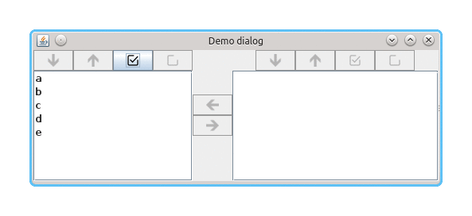

JProgressDialog
---------------
An extension of `JDialog` to ease the creation of simple progress dialogs based on a task list.

RadioButtonsPanel
-----------------
A panel that displays a list of elements using `JRadioButton`s. It is designed to be an alternative to `JComboBox` when you want all values visible to the user.

RangeInputPanel
---------------
A panel that allows user selecting a range of values using sliders, taking into account that the minimum value should always be lower or equal to the maximum value.

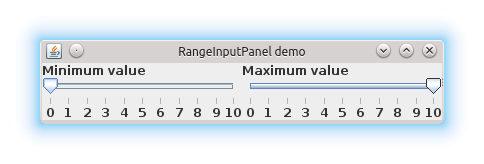

RowHeaderExtendedJXTable
------------------------
An extension of `ExtendedJXTable` to allow users creating tables within a row names column.

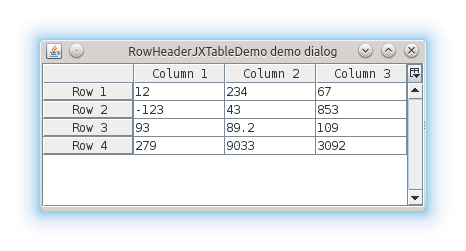

Wizard
------
A wizard dialog shows a list of wizard steps (implemented by `WizardStep` objects).

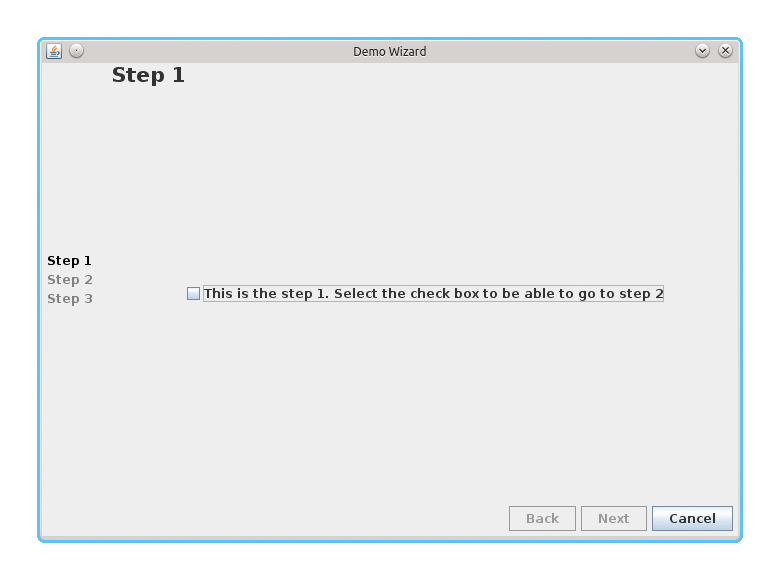

WorkingDialog
-------------
A dialog that shows a progress in work dialog with an indeterminate progress bar and a label. The indeterminate progress bar may be replaced by a user image.

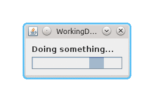