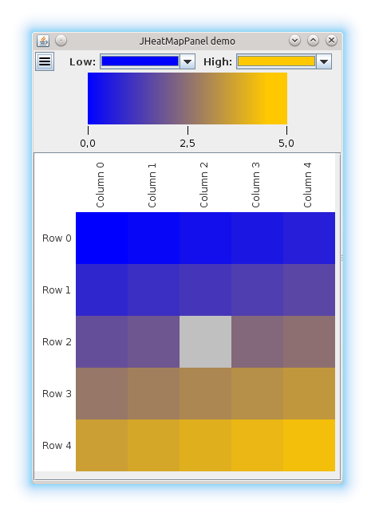

The `gc4s` module
=================

This module contains the bioinformatics-oriented collection of GUI Components for (Java) Swing. Javadoc documentation is available [here](http://sing-group.org/gc4s/javadoc).

Using this module
-----------------
Add the following repository and dependency declarations to your `pom.xml`:
```xml
	<repositories>
		<repository>
			<id>sing-repository</id>
			<name>SING repository</name>
			<url>http://maven.sing-group.org/repository/maven/</url>
		</repository>
	</repositories>
	
	<dependencies>
    	<dependency>
			<groupId>org.sing_group</groupId>
			<artifactId>gc4s</artifactId>
			<version>1.0.0</version>
		</dependency>
	</dependencies>
```

Examples
--------

The following image shows `JHeatMap`, a component that shows a heatmap from a given double matrix. It allows zooming, changing gradient's colors and exporting the heatmap as image.



The following image shows `JFileChooserPanel`, a component with a button to select a file (using a `JFileChooser`) and a text field that show the selected file. You have full control of how the underlying `JFileChooser` since you have can set file filters or choose the dialog mode.


These are just two examples of GC4S components. To see more, please, see the [examples](EXAMPLES.md) section. Also, the `gc4s-demo` module provides examples of usage of most of the components.
